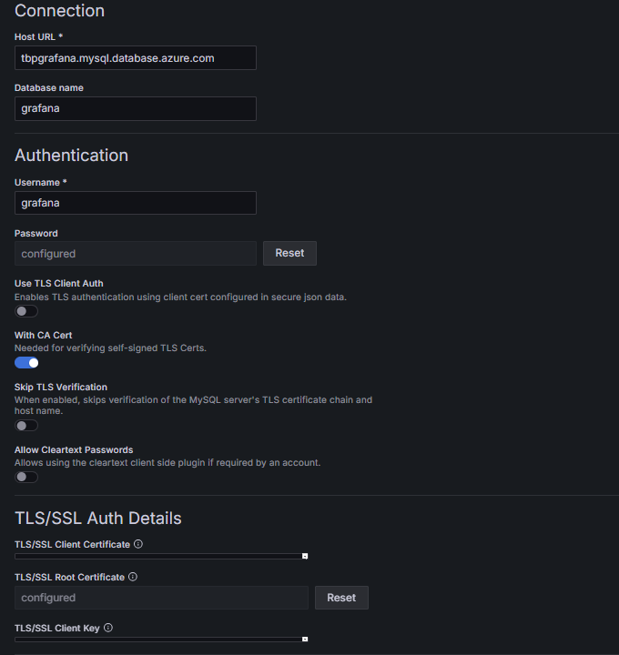
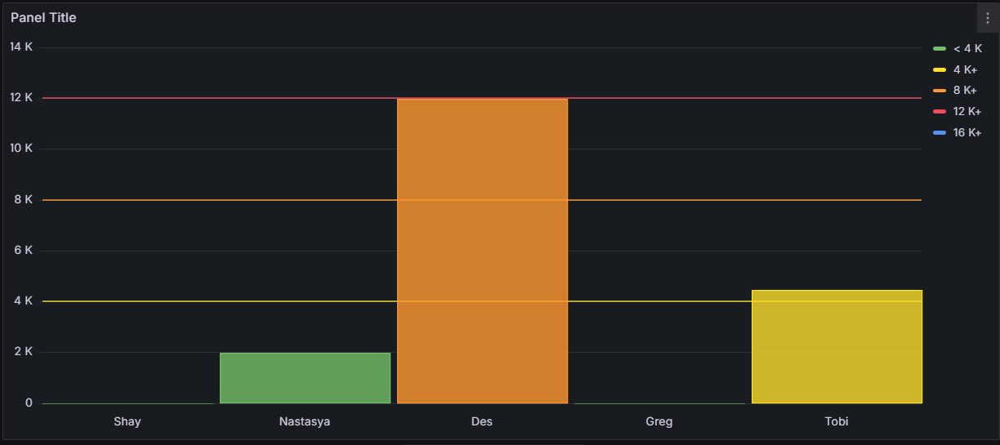

# 1.  PROJECT DESCRIPTION

### 1.1 Project Objectives

The project aims to create dashboards in Grafana that transforms raw
data from a data source into beautiful charts, graphs and other
visualizations. These dashboards will be helpful in understanding and
monitoring the data to make insightful decisions.

The primary objectives of the project are:

1.  Identifying the data source needed for the dashboards and
    configuring a secure and live connection to the database from
    Grafana using the necessary plugin provided.

2.  Creating and designing dynamic dashboards that visualizes the
    configured data source and making effective analysis from the
    dashboards.

### 1.2 Key Features

1.  Creating dynamic dashboards with the help of variables and templates
    that allows the users to filter and choose data without modifying
    the dashboard itself.

2.  Customization of the panels in dashboards with the help of color
    themes to enhance the visual appeal and using thresholds and display
    values to provide more insights on the data.

### 1.3 Technologies used

-   **MySQL Database**: The database contains the data that needs to be
    visualized. Connection must be established between Grafana and this
    database.

-   **Grafana**: The open-source software that enables users to visualize
    the data by creating dynamic dashboards.

# 2. USER GUIDE FOR THE PROJECT

### 2.1 Configure the Data Source

1.  On the Grafana Home dashboard, open the side menu and select
    'Connections' -\> 'Add new connection'

2.  Search for the type of data source you wish to add (eg. Mysql).
    Select the data source that appears and then click on 'Add new data
    source'.

1.  Provide all the details about the database and click on 'Save &
    test'. On successful connection, you will get a 'Database Connection
    OK' message.

This will have added your database as a data source in Grafana. You do
not need to configure this or add a new connection every time you create
a new dashboard. Once configured, this connection can be used for
multiple dashboards.

### 2.2 Create Dashboard in Grafana

1.  On the Grafana Home dashboard, open the side menu and select
    'Dashboards'. On the panel that opens on the right, click on 'New'
    and from the dropdown select 'New dashboard'.

2.  You will get some options to choose on how to create dashboard. As
    we are creating a new dashboard, select 'Add visualization'. This
    will prompt you to choose the data source. Here, select the data
    source that was configured.

1.  In the panel that is open, you can create a visualization of any
    type. From the query section, select 'Code' and write the query that
    will get you the desired outcome.

(eg. A query that gets total count of deals for each owner)

Run the query.

1.  On the panel, click on 'Open visualization suggestions'. This will
    open a suggestion box on the right side that will give many graphs
    and charts that can be used for your query outcome. Select the
    desired type of chart or graph and visualize the data.

1.  From the panel options, give a name and description to the panel.
    Then save the panel.

2.  On saving the first panel, it will ask you to save the dashboard
    also. Provide the name and if needed description for the dashboard
    and save it.

1.  The dashboard which will contain the panels created will be opened.
    As of now there is only one, new panels can be created by clicking
    on 'Add' from top menu and selecting 'Visualization' from the
    drop-down.

But panels created are static. In the panel we just created, if we wish
to see deals by specific owners only or total deals in month or total
deals in week, there is no option of doing that.

Grafana has provided variables to make our dashboards dynamic.

### 2.3 Create variables and use them

1.  From the dashboard top menu, click on the settings gear icon. From
    here, choose 'Variables' and select 'Add Variable'.

1.  Fill the details such as name of the variable and the query that
    will generate the values for variable. Tick the multi-value and
    include all options.

'Multi-value' allows us to select multiple values together and 'Include
all' created a 'All' option which selects all the values by default.

(eg. Creating a variable 'email' that gives us the email of the owners)

Run the query and see all the values that will be the output of the
query and then click on 'Apply'.

1.  Just like this, you can create variables for week and month. Save
    the dashboard to save all these variables.

1.  Now in the dashboard, you can see the variables as a drop-down on
    the top.

1.  To use these variables, we have to modify the query in the panel.
    Variables in Grafana are referenced like \${variable_name}. So, in
    the query, include a where condition that filters data on these
    variables.

Grafana provides formatting of variables like singlequote, doublequote,
csv, json etc..,

(eg. \${week:singlequote} indicates Grafana to format the values
obtained by the variable in single quotes. So, if the variable value is
25, it will be formatted as '25')

1.  After you run the query, choose different values from the variable
    drop-down and see the chart or graph in the panel will modify to
    represent that data.

The panels created in Grafana have default coloring scheme. You can
customize these based on values, thresholds and color schemes.

### 2.4 Steps to customizing the dashboard

1.  In the right side of the panel, for the visualization type you
    choose, there will be some settings you can customize.

(eg. A bar chart that shows monthly MRR obtained from owners)

1.  From here, choose the 'color by field' which will indicate which
    field in the chart should be taken as the basis for coloring. From
    the drop-down, select the field you want (eg. MRR)

1.  From 'Standard options', choose 'color scheme'. There are some
    default color schemes provided by Grafana. You can choose those or
    for customizing based on value, select 'From thresholds (by value)'.

1.  To provide the threshold value, under the 'Thresholds' section, you
    can add custom values and color for them. When the value in the
    panel is equal or greater than this threshold value, corresponding
    color will be applied.

You can also specify if you want these threshold values to be made
visible as lines, dashed lines etc..

You can use absolute values or percentages depending on the graph or
chart.

1.  You can see the changes on the graph according to the values given.
    Save these changes to the dashboard.

